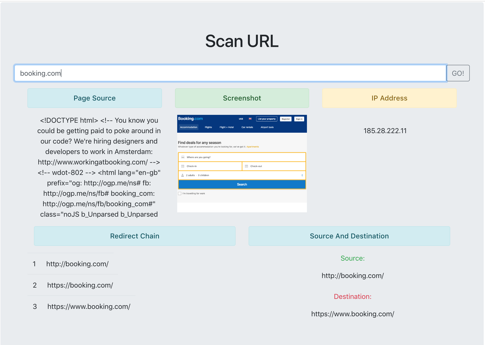

# Scan URL

This projects automatically extracts the relevant information from the given url of a website. 

## Dependency Installation and Running the APP
1. Navigate to the app's main directory and Install npm modules: `npm install`
2. Navigate to the app's main directory and Install bower dependencies `bower install`
3. Execute `mongod` on terminal tab to start running the mongodb instance
4. Create a database called "redmarlin" or name it yourself and change the name configuration in config/config.js
5. Mongoose will automatically create a collection called "siteinfos" when the first request has been made.
6. Navigate to the app's main directory and start up the server by executing: `node server.js`
7. View the running app in browser at http://localhost:8080

## FEATURES
* Screenshot
* Page source
* IP address
* Source and destination URLs (in case of redirection)
* Redirect Chain (in case of redirection)
* All requests made by the site
* ASN information for IP address
* SSL Certificate details in case of https site

## External Backend Libraries
* https://www.npmjs.com/package/ip-to-asn
* https://github.com/GoogleChrome/puppeteer
* https://github.com/WebReflection/circular-json

NOTE: Getting the response may take a while, depending on how fast/slow the website we're querying and how much information there.
Sections like Page Source and All Requests are scrollable, make sure you check them out!
Requests sent by a website and other information could also be saved into the db in a desired format as future work.

  
  

